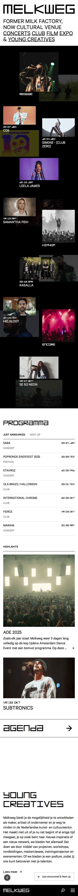

# Procesverslag
Markdown is een simpele manier om HTML te schrijven.  
Markdown cheat cheet: [Hulp bij het schrijven van Markdown](https://github.com/adam-p/markdown-here/wiki/Markdown-Cheatsheet).

Nb. De standaardstructuur en de spartaanse opmaak van de README.md zijn helemaal prima. Het gaat om de inhoud van je procesverslag. Besteedt de tijd voor pracht en praal aan je website.

Nb. Door *open* toe te voegen aan een *details* element kun je deze standaard open zetten. Fijn om dat steeds voor de relevante stuk(ken) te doen.

## Jij

  
uitwerken voor kick-off werkgroep

  ### Auteur:
  Saskia Kalkman

  #### Je startniveau:
  Blauw/Rood 

  #### Je focus:
  Surface plane

  1. Video
  2. Audio 
  3. animatie 
  4. dark en light mode
  5. font sizing
 

## Je website

  
uitwerken voor kick-off werkgroep

  ### Je opdracht:
  https://www.melkweg.nl/nl/

  #### Screenshot(s) van de eerste pagina (small screen): 

  
  In de screenshot zijn niet alle plaatjes te zien (meerdere screenshots geprobeert te maken maar het kwam er niet op)

  #### Screenshot(s) van de tweede pagina (small screen):
  
  
  zelfde als de home pagina, dingen zoals bijv. de spotify playlist staan niet in de screenshot maar wel op de pagina 
 

## Toegankelijkheidstest 1/2 (week 1)

  
uitwerken na test in 2e werkgroep

  ### Bevindingen
Hoofdpagina: De hoofdpagina en het overzicht van het schema zijn over het algemeen goed opgedeeld. De screenreader kan deze content makkelijk en duidelijk voorlezen, waardoor navigatie op deze pagina relatief probleemloos verloopt.

Andere pagina’s: Op pagina’s met meer tekst, zoals achtergrondinformatie of artikelen, is het een ander verhaal. Veel teksten zijn niet selecteerbaar of niet leesbaar voor de screenreader; deze geeft vaak alleen “webmateriaal” weer in plaats van de daadwerkelijke inhoud. Hierdoor missen gebruikers een groot deel van de informatie.

Nieuwsbrief: De nieuwsbriefsectie is een duidelijk voorbeeld van ontoegankelijke content. De screenreader kan deze content niet goed voorlezen, waardoor gebruikers geen toegang hebben tot belangrijke updates en informatie.

Extra informatie over evenementen: Op de pagina’s met informatie over evenementen valt op dat veel aanvullende content niet toegankelijk is. Alleen de links in de tekst zijn selecteerbaar, terwijl de rest van de tekst volledig wordt overgeslagen. Hierdoor kan een screenreader-gebruiker niet volledig begrijpen waar een evenement over gaat of wat de details zijn.

Algemene indruk: Hoewel sommige onderdelen van de website, zoals de hoofdpagina en het schema, goed functioneren met een screenreader, is het grootste deel van de website ontoegankelijk. Vooral tekstintensieve pagina’s en aanvullende informatie zijn problematisch, waardoor het voor gebruikers die afhankelijk zijn van screenreaders moeilijk is om de website volledig te gebruiken.

Conclusie:
De Melkweg-website is op enkele plekken beperkt toegankelijk. De hoofdpagina werkt redelijk, maar zodra men verder de site in gaat, wordt duidelijk dat veel content ontoegankelijk is voor screenreaders. Belangrijke informatie, zoals nieuwsbrieven en extra details over evenementen, kan niet volledig gelezen worden, waardoor de gebruikerservaring voor mensen met een visuele beperking sterk wordt beperkt

## Breakdownschets (week 1)

  
uitwerken na afloop 3e werkgroep

  ### de hele pagina: 
  

  ### dynamisch deel (bijv menu): 
  

  ### wellicht nog een dynamisch deel (bijv filter): 
  

## Voortgang 1 (week 2)

  
uitwerken voor 1e voortgang

  ### Stand van zaken
  over het algemeen gaat het opzetten van de 2 html's makkelijk. enige waar ik tegen aan loop is dat niet alle ccontent van de website download dus ik mot het handmaatig uit de melkweg site halen, ook verandert de melkweg website met elke refresh wat het een beetje lastig maakt om de juiste content te plaatsen

  ### verslag van meeting

  "Goed dat je @font-face gebruikt voor het inladen van fonts. Nette css opzet, niks op aan te merken. Gebruik custom properties, dit is een van de surface plain dingen waarvan je er 5 moet hebben. Spacing tussen css consisstent houden.
 
Header kan je weghalen op je tweede pagina, is alleen voor navigatie. In elke section moet een heading staan voor de toegankelijkheid, hier is een trucje voor deze kun je in onderstaande link checken." 

## Voortgang 2 (week 3)

  
uitwerken voor 2e voortgang

  ### Stand van zaken
  Ik heb nog al veel last met de css, het is allemaal een stuk detaileerder dan op eerste oog opslag te zien is, veel verschillende font sizes en dingen die niet heel consistent zijn ( bij het highlight gedeelte bijvoorbeeld). Ik vind het nog heel moeilijk om de foto's op de homepagina ( in het event gedeelte) goed te plaatsen omdat de een beetje 'rommelig' staan. Dus daar moet ik nog even goed voor gaan zitten. 

  ### Agenda voor meeting
  
  Vragen: 
  1. Hoe codeer ik het event gedeelte 
  2. Mijn footer blijft niet plakken 
  3. Hoe plaats ik mijn foto's op de juiste plek? 

  ### Verslag van meeting
Ik snap nu hoe ik mijn foto's makkelijk met het gebruik van grid op de juiste plek kan zetten, ook hoe ik deze op de achtergrond ook kan toevoegen. Mijn footer blijft nu goed plakken en werkt verder goed. 
Ook heb ik een aantal dingen aangepast in mijn html die nog niet helemaal lekker liepen. 

## Toegankelijkheidstest 2/2 (week 4)

  
uitwerken na test in 9e werkgroep

  ### Bevindingen
 Homepagina:

 Op de homepagina leest de screenreader over het algemeen de content goed voor. In tegenstelling tot de originele pagina wordt geen tekst overgeslagen en blijft de structuur van de code intact. Ook de alt-teksten worden correct voorgelezen en de links zijn duidelijk hoorbaar. Daarnaast wordt aangegeven wanneer een link al bezocht is, wat de navigatie vergemakkelijkt.

Reggae-pagina:
De reggae-pagina wordt over het algemeen goed voorgelezen. Het programma wordt duidelijk genoemd en het is eenvoudig om door de pagina te navigeren. Het enige punt waar de voice-over soms vastloopt, is bij de Spotify-playlist. Hierbij gaat de screenreader eerst door elk nummer voordat hij verdergaat met de rest van de content. Dit komt doordat de playlist via een iframe is ingebed. Helaas is het lastig om dit op een andere manier op te lossen, waardoor dit onderdeel minder toegankelijk is, ook op mijn eigen website.

Conclusie:
Mijn website is tot nu toe toegankelijker dan de originele website. Alle content wordt goed voorgelezen en de navigatie is duidelijk, waardoor bezoekers makkelijker door de site kunnen bewegen.

## Voortgang 3 (week 4)

  
uitwerken voor 3e voortgang

  ### Stand van zaken
  Over het algemeen komt de website al goed samen, het enige waar ik echt nog wel tegen aanloop is het event gedeeelte met de foto's. ook merk ik dat het stylen van de programma's gedeeltes ook lastig is omdat er dus meerdere dingen op een specifieke manier staat met verschillende fonts/font sizes ect. ik merk dat ik het lastig vind om de kleine details na te maken. ik moet me nu voornamellijk gaan focussen op de details (zoals margin's, paddings, font sizes ect.) en de 5 surface plane dingen.

## Eindgesprek (week 5)

  
uitwerken voor eindgesprek

  ### Je uitkomst - karakteristiek screenshots:
  

  ### Dit ging goed/Heb ik geleerd: 
  Korte omschrijving met plaatjes

  

  ### Dit was lastig/Is niet gelukt:
  Korte omschrijving met plaatjes

  

## Bronnenlijst

  
continu bijhouden terwijl je werkt

  Nb. Wees specifiek ('css-tricks' als bron is bijv. niet specifiek genoeg). 
  Nb. ChatGpT en andere AI horen er ook bij.
  Nb. Vermeld de bronnen ook in je code.

  1. H2 verbergen: 
  https://medium.com/web-dev-survey-from-kyoto/the-visually-hidden-technique-303f8e2bd409 en 
  hulp gekregen van de student assistenten 

  2. Costum properties: https://developer.mozilla.org/en-US/docs/Web/CSS/CSS_cascading_variables/Using_CSS_custom_properties
  https://css-tricks.com/a-complete-guide-to-custom-properties/ 
  hulp van student assistenten 

  3. Label: https://dev.to/joxx/building-a-tab-component-with-pure-css-using-radio-and-label-tags-200b,
   https://www.youtube.com/watch?v=cPESNzIA-Wg, 
   hulp student assistenenten. 
   Chat gpt prompth: hoe maak ik een label in html en css? 

   4. Grid layout: https://www.youtube.com/watch?v=EiNiSFIPIQE
   https://www.youtube.com/watch?v=v0o1kV-qfVI
   https://www.youtube.com/watch?v=rg7Fvvl3taU

   5. aria-label: https://developer.mozilla.org/en-US/docs/Web/Accessibility/ARIA/Reference/Attributes/aria-label
   https://stackoverflow.com/questions/22039910/what-is-aria-label-and-how-should-i-use-it

   6. Spotify playlist: https://developer.mozilla.org/en-US/docs/Web/HTML/Reference/Elements/iframe
   Chatgpt prompth: How do you add an embedded spotify playlist to your html? 

   7. Dark en light mode: https://developer.mozilla.org/en-US/docs/Web/CSS/color_value/light-dark
   https://www.reddit.com/r/webdev/comments/xxwj6l/whats_the_most_efficient_way_to_implement_dark/
  https://www.youtube.com/watch?v=_gKEUYarehE
   https://www.youtube.com/watch?v=Y4n9bYLjrIE
   https://www.youtube.com/watch?v=F1s8MZoGVL8
   https://www.youtube.com/watch?v=rj4KQEdzK_U
   Chat: hoe zorg ik ervoor dat de tekst niet mee verkleurd met de dark en light mode? 

   8. Font sizing: kon geen goede uitleg vinden dus: 
   Chat gpt: How do i code font changing size for the user? 
   Chat gpt: How can i do make a button with which users van change font size on my website? 

   9. Audio/Video : https://developer.mozilla.org/en-US/docs/Learn_web_development/Core/Structuring_content/HTML_video_and_audio

10. Pause en play button: https://www.youtube.com/watch?v=Qh4bzK_IiE0
Chat gpt: How do i make the play and pause button so that it works? 
Chat gpt: It doesnt work how can i make it so that user can pause and play 

11. Javascript: https://www.youtube.com/watch?v=Ihy0QziLDf0
https://developer.mozilla.org/en-US/docs/Web/JavaScript

